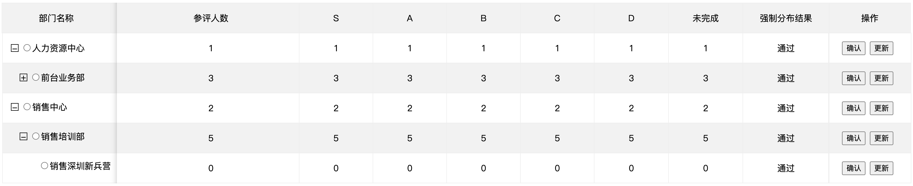

# tree-table

## 效果图



### api

1. titles: 自定义表头字段
2. initTableData: 表格初始数据
3. initTreeData: 树形初始数据
4. currentData: 当前操作数据
5. updateTreeDataAfterEdit: 在数据修改后更新树结构数据
6. toggle: 切换搜索展开
7. onSelect: 单行选中后回调
8. onDataUpdated: 单行数据更新后回调

### 功能

- 树形和表格联动
- 可获取、更新、修改单行数据
- 自适应

### 说明

- css：树和表左右结构布局，利用等高对齐、首行缩进等样式实现；
- js：利用id关联，数据变更时，始终保持使两部分数据对齐；

### 备注

- 本打算封装成npm包，但各业务需求不同，直接贴源码，方便直接修改
- 无特殊依赖
- mock-api下有数据结构，可根据需求参考或修改

## Project setup
```
yarn install
```

### Compiles and hot-reloads for development
```
yarn run serve
```

### Compiles and minifies for production
```
yarn run build
```

### Run your tests
```
yarn run test
```

### Lints and fixes files
```
yarn run lint
```

### Customize configuration
See [Configuration Reference](https://cli.vuejs.org/config/).
